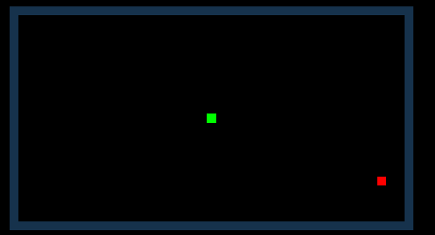

# SnakeDeepReinforcedLearning

This is a project trying to create a deep reinforced learning agent using the ML agents package of Unity capable of learning to play to Snake.

## Unity and C#
This project was entirely made in Unity, using C# and mainly the package ML-agents for Unity. The complete code for the project is in the repository and it can be use to train more agents for the same game or to learn how to use this same technique for any other game that it is run on Unity. 
To teach the agents is used the proximal policy optimization. It work by trying to maximize the reward optain in the least possible number of steps. A longer explanation is in the presentation of this project.

## Method use

For this agent the information provided was its own coordinate, the coordinate of the reward and the distance to an obstacle in each direction. This is not a complete information of the environment. However, it is enough for the agent to learn the basic and to obtain the reward. When the snake became too large, the lack of information can result in the snake trapping itself. 

Even with the problems of this method, the training is really fast. 

## Results

The agent was capable of learning to get the reward and to avoid the walls. 
 
Known issue: the decay for the reward is too large and it will end up going against the wall when it has receive some rewards.

We can see the increase in the reward obtain base on the time learning in the following graph:

